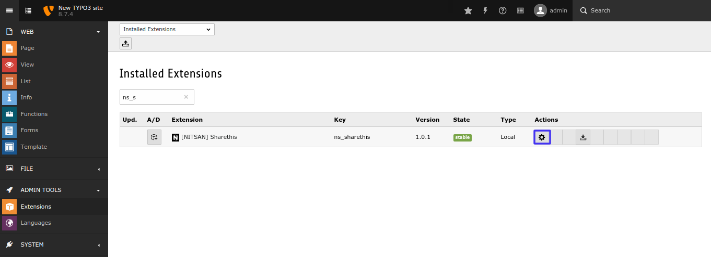
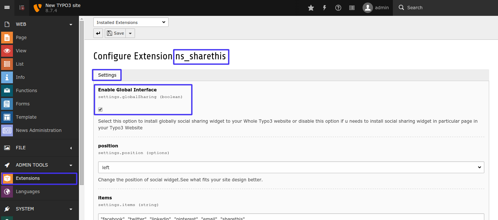
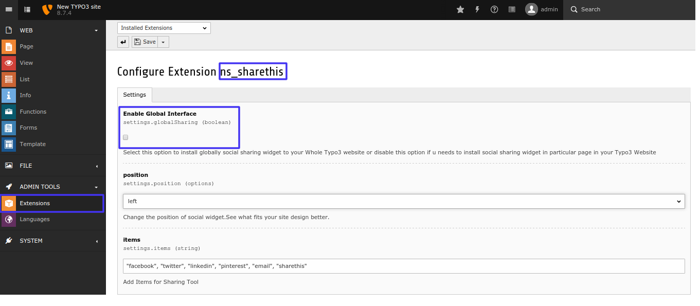

.. ==================================================
.. FOR YOUR INFORMATION
.. --------------------------------------------------
.. -*- coding: utf-8 -*- with BOM.

.. include:: ../../Includes.txt

.. _configuration:

Configuration
=============

Quick & Easy "Global" configurataion of Sharethis.com
-----------------------------------------------------

**Step 1:** Switch to the module Admin tools *Extensions* and then edit **configuration**.

**Step 2:** Enable Global Interface into this **settings** Take a look at screenshots as follows.

Setup "Particular Page Only" configuration of Sharethis.com
-----------------------------------------------------------

**Step 1:** Switch to the module Admin tools *Extensions* and then edit **configuration** and then **Disable Global Interface** into this *settings*.

**Step 2:** Now add extension Above/Below page as per your requirement.

**Step 3:** Now select plugin **Nitsan Social widget** and configure it as per requirement, Checkout this screenshot

.. figure:: Images/TYPO3-EXTns_sharethis-Config_2-2.png
   :alt: Config_2-1

.. figure:: Images/TYPO3-EXTns_sharethis-Config_2-3.png
   :alt: Config_2

Clear Cache:
------------

Please clear cache from Top panel 'Flush frontend caches' & 'Flush general caches'. It will be also great to clear cache from Install tool too.