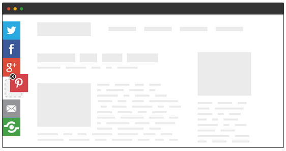
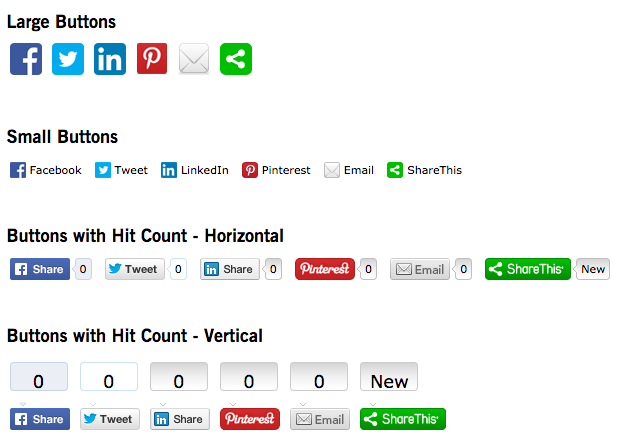

.. ==================================================
.. FOR YOUR INFORMATION
.. --------------------------------------------------
.. -*- coding: utf-8 -*- with BOM.

.. include:: ../Includes.txt

What does it do?
================

One of the only TYPO3 extension is developed to integrate all the features of www.Sharethis.com which is one of the most popular third-party social media platform!

www.Sharethis.com is a free Social Media platform which provides professional and highly customizable ecosystem for social media sharing and optimizing of your valuable content. Take a look at their site at `https://www.sharethis.com/ <https://www.sharethis.com/>`_

It will increases traffic & engagement by helping people share your posts and pages to any service. Services include *Facebook*, *Twitter*, *Pinterest*, *Google*, *Gmail*, *LinkedIn* & "over 100 more" sharing and social media sites & apps.

Screenshots
============

Frontend of your site with "Global" social shareing
---------------------------------------------------

Frontend of your site with social shaing "Inside Page"
------------------------------------------------------

"Buttons Layout"
------------------------------------------------------

